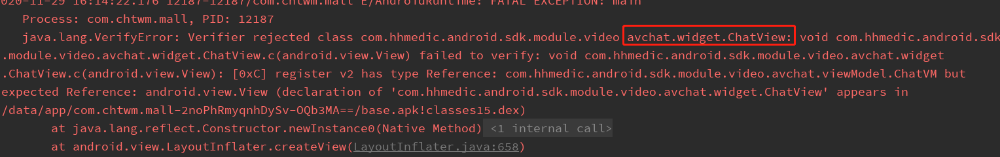

## 接入SDK过程中遇到的问题及一般解决方案

### 1. 由于SDK中引用库和接入方引入库发生冲突造成的问题

* 问题描述1如下：
> Execution failed for task ':app-container:transformClassesAndResourcesWithProguardForPrdRelease'.***********(Can't process class [module-info.class] (null))

* 问题描述2如下：
> ava.lang.NoClassDefFoundError: Failed resolution of: Lcom/google/gson/GsonBuilder;
        
* 问题描述3如下：
> 如果遇到库冲突也就是duplicate某个包这说明库冲突了
        
*以上已经具体描述了由于引用了相同库不同版本会造成的问题，这类问题一般可以采用force引用库版本来解决，具体操作示例如下，以gson库为例。*

```
android {
    .....
    configurations.all {
        resolutionStrategy.force 'com.google.code.gson:gson:2.8.0'
    }
}
```

如果是遇到如上问题可以通过以上gradle配置代码给出的示例代码去force对应的库版本一般可以解决，目前遇到的真实案例就是这个库版本冲突造成的问题，请参考。

### 2. SDK接入过程出现了如下图的类似问题 Verifier rejected class


遇到如图类似的问题这种情况是因为接入SDK的项目中存在一些特殊引用库把我们SDK内部一些代码篡改造成的。遇到这类问题可以及时联系我们或更新成其他版本的SDK。
